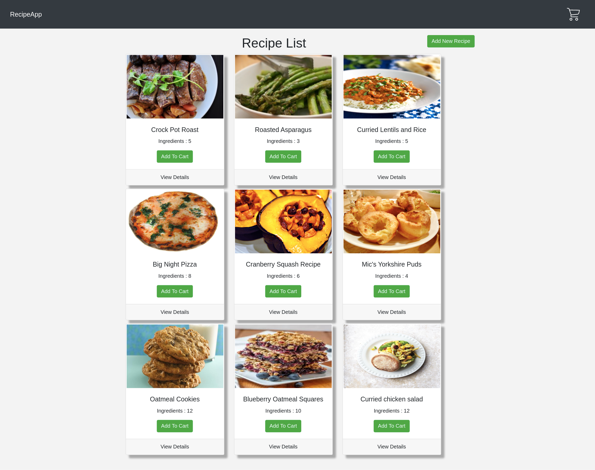
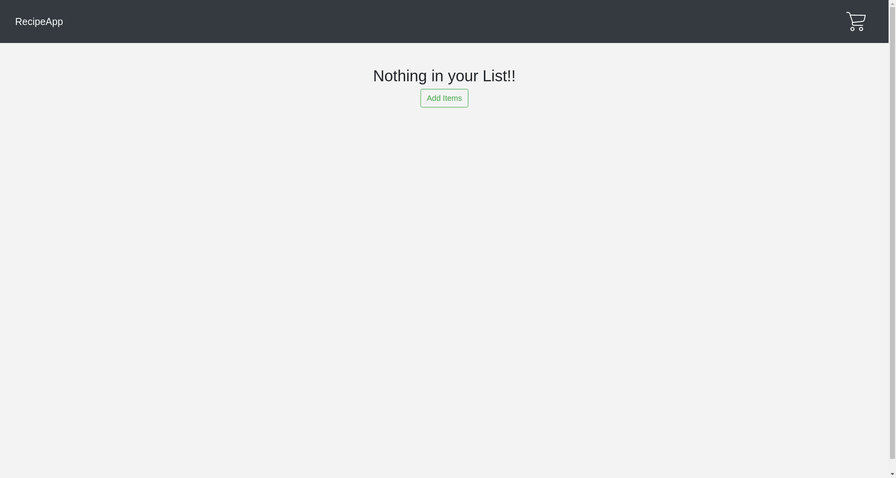
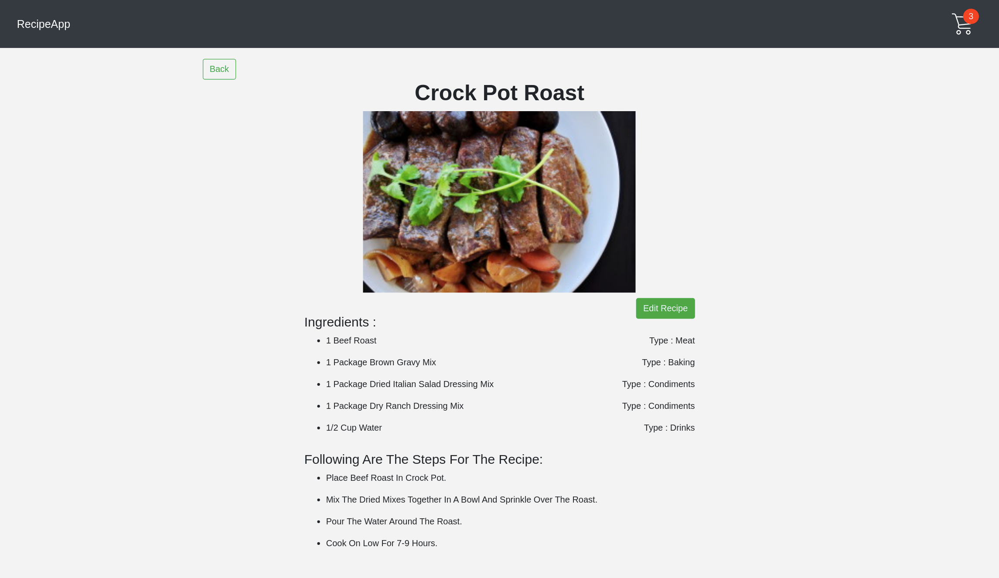
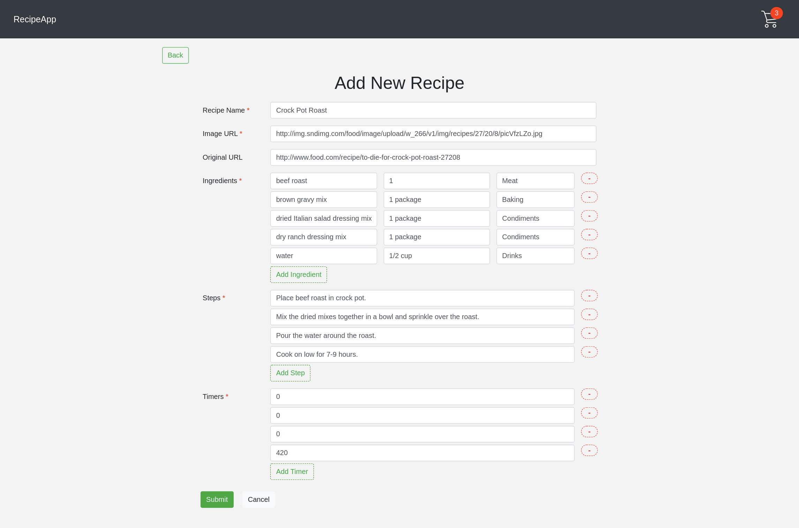
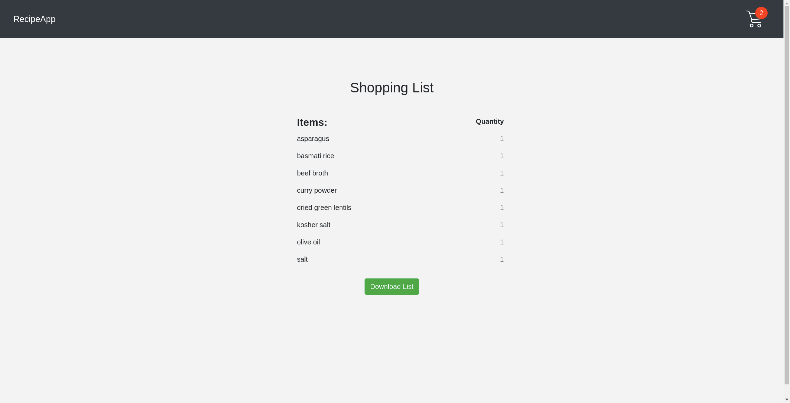

# RecipeApp

RecipeApp is a web app in which a list of recipes is displayed to the user.

A user can add new recipe and can edit any recipe.

There is an add to card option too which creates a cart list of ingrdients of the recipes and user can export the recipes in the form of CSV file.

